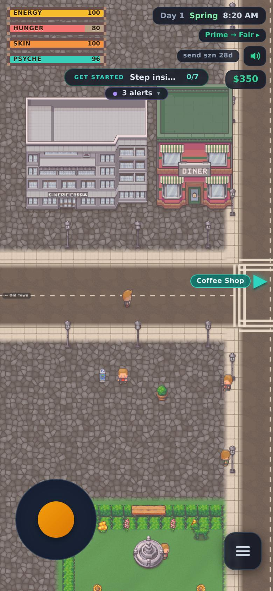
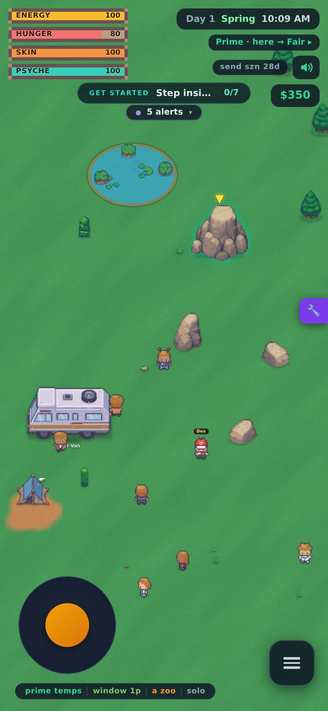
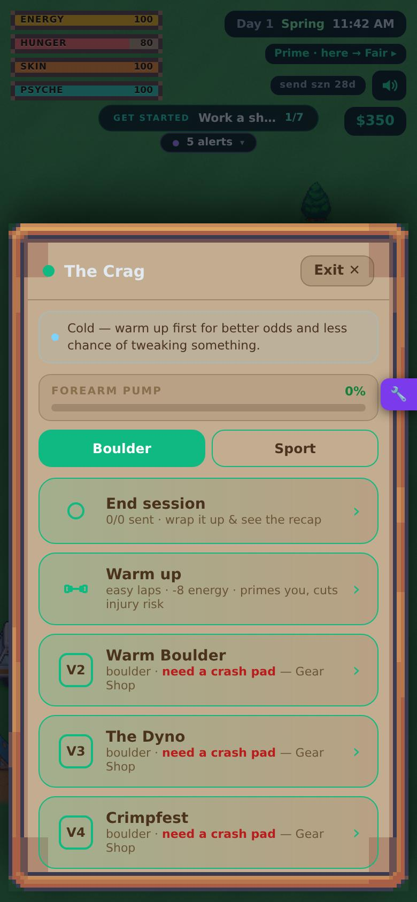
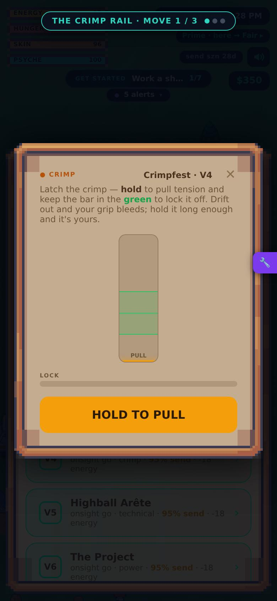
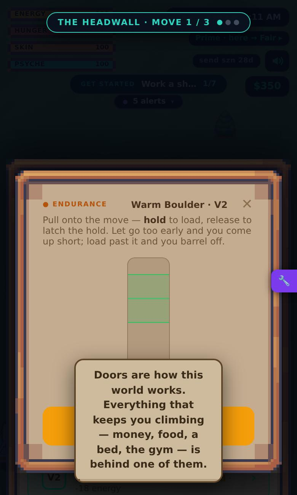
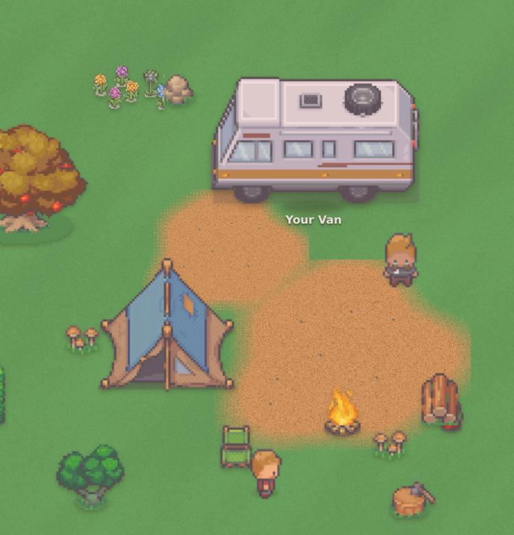
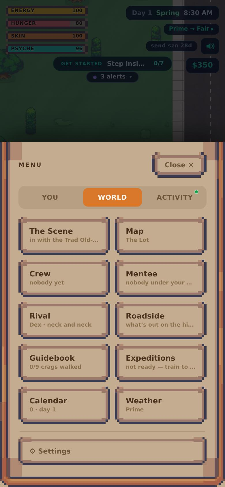
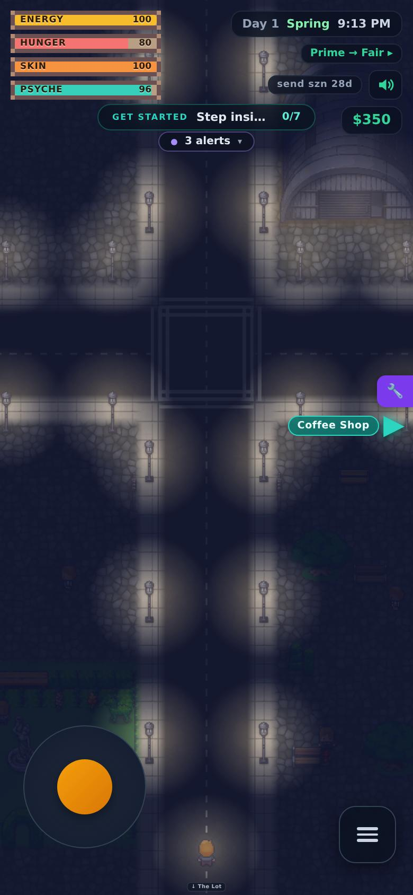

# Dirtbag (HTML/PWA): full audit and analysis

*v0.956.0 · audited 28 Sep 2026 · companion plan: [ROADMAP.md](ROADMAP.md) (20 phases) · evidence: [`docs/audit/`](audit/)*

> **Verdict.** Dirtbag v0.956 is a deep, well-written climbing life-sim whose systems have outgrown their structure.
>
> **What's rare about it:**
> - about 82,000 words of prose in a distinctive dry, second-person voice;
> - a body model (skin, pump, training load, injury, age) that climbers will recognize as true;
> - partners and townspeople who remember what you did;
> - a competition engine and a route-setting puzzle that are good games in their own right.
>
> **Why it isn't a product yet.** The gap is not missing features:
> - **No spine or ending.** Nothing ties the game together after the first ten days.
> - **The central tensions collapse within weeks:** earning versus climbing, and earning a friendship.
> - **The key moments are invisible.** The climb has no climber on screen, and the town doesn't show what anything is.
> - **The build is fragile.** One bad byte in a save can wipe it, and the code can't be changed safely: there's no source in the repo, the game is one 66,000-line component, and the page is 15 MB.
>
> **The way to "sellable" is to consolidate before adding:**
> 1. Freeze features.
> 2. Make the code safe to change.
> 3. Decide the spine and the cut list.
> 4. Put climbing on screen.
> 5. Rebuild the town so it reads at a glance.
> 6. Ship a free first season and a paid full game, with Steam as the main bet.

**Two things to know before reading on:**
- This repository contains **only the compiled build**. The audit was done on the extracted, prettified JavaScript bundle (105K lines), plus a hands-on playthrough in a phone-sized browser. Line numbers like `(51145)` refer to that prettified bundle (see [How this audit was done](#how-this-audit-was-done)).
- Claims carry an evidence label:
  - [ESTABLISHED]: read directly in code or data;
  - [MEASURED]: observed by running the build;
  - [INFERRED]: reasoning, simulation or estimate.

## At a glance

### Scorecard

| System | State | One-line verdict |
|---|---|---|
| Writing and voice | `strong` | ~82K words; the late-written register is a real selling point. Needs a US-English style pass, and better surfaces than 5-second toasts. |
| Body, load and injury | `strong` | The deepest system, and it stays relevant late. Month one is an injury spike, and load isn't shown where you decide to climb. |
| Climbing model | `solid` | Coherent and climber-true. Attempts play as quick-time events and dice. The core verbs are rare, there are free exploits, and the top end runs out of routes. |
| People and memory | `solid` | Excellent memory systems. Bond inflates in days, and authored content runs out by day ~60–100. |
| Competitions | `solid` | The best-built meta system. Fields are rubber-banded, skipping costs you, and "Olympic" is a trademark problem. |
| Character identity | `solid` | Rich, well-written creation. Its effects wash out by ~V5. |
| Survival and van life | `needs work` | Real pressure for ~2 weeks, then chores or one-time fixes. Failure is a cliff with no warning. |
| Jobs, money and media | `needs work` | Money stops mattering after week 1–2. Media income runs away, and jobs out-train climbing. |
| Goals, structure and endings | `needs work` | No story after V4, ~28 overlapping trackers, no ending, and legacy wipes almost everything. |
| World map and art | `needs work` | Mixed asset packs at mixed scales. Buildings don't say what they are, and the crag reads as a park. |
| UI, onboarding and input | `needs work` | 28 panels on day 1 and ~200 modal states. Portrait and touch only, with no keyboard or gamepad. |
| Engineering and saves | `critical` | Source isn't in the repo, saves can be silently wiped or bricked, a 66K-line component, a 15 MB page. |
| Product readiness | `critical` | "Olympic" in the content, a name that can't be trademarked alone, no monetization path for the existing Play listing, and dev cheats live in production. |

### The ten problems that matter most, in order

1. `critical` **The source isn't in version control here.** The repo is 59 commits of uploaded builds. If the source exists only on one machine, the project is one disk failure from gone. It also can't be worked on with review, CI or Claude Code. [ESTABLISHED]
2. `critical` **Saves can be lost to one bad byte.** Two reproduced cases: a corrupt or slightly malformed save is replaced with a fresh day-1 game within 2.5 s, and one null field blanks the app on every launch with no way to reach Settings. There are no backups and no save version. [MEASURED]
3. `critical` **One league night can erase weeks of progress.** Five code paths clamp a skill to 0–100 while grades need 100–922. A V8 climber can drop to V6 in one evening while the toast says "+13". [ESTABLISHED]
4. `high` **No spine and no ending.** The only main quest ends at V4 (~day 10). After that it's a numeric ladder and a buffet of ~28 overlapping trackers. The V18 finale gets a generic pop-up, retirement is forced at 45 with no warning, and legacy resets almost everything. [ESTABLISHED]
5. `high` **The central tensions collapse early.**
   - Money stops mattering around day 12–15, and media income reaches ~$2,300/day.
   - Relationships max out in days: romance goes from spark to "move in" in ~4.
   - Survival meters become chores, and jobs out-train climbing past V8.
   
   The Stick-RPG hook (every day is a trade) exists only in week 1. [ESTABLISHED formulas / INFERRED sims]
6. `high` **The climb, the heart of the game, has nothing to watch.** It's a list row and then a modal with a bar. The designed verb (HOLD TO CLIMB) is 2–6% of beats, the minigames ignore pump, skin and energy, and odds hit a hidden cliff 1.5 grades up. [ESTABLISHED/MEASURED]
7. `high` **The town is hard to read and slow to use.** Mixed asset packs, buildings that don't show their function, no fast travel or keyboard, and a daily loop of 30–80 taps plus joystick walking. The crag looks like a park. [MEASURED playthrough; tap counts INFERRED]
8. `high` **The best writing is hidden or worn out.**
   - Stance results of up to 91 words flash by in toasts capped at 5.2 s, with no message log.
   - Random pools run dry by ~day 60.
   - Three generations of writing and a British/US dialect split coexist. [ESTABLISHED]
9. `high` **It loads and runs heavily.** Cold start on mid-range 4G is ~11 s. The full save is rewritten every second, zone changes freeze for up to ~0.5 s, and memory climbs to ~400 MB. [MEASURED]
10. `high` **It isn't a product yet.**
    - "Olympic" appears on 27 lines of text, and US law protects that word.
    - The bare name "Dirtbag" is crowded.
    - The existing free Play listing can't become paid.
    - `?dev` unlocks cheats in the live game.
    - The privacy and terms text doesn't match reality or a paid model. [ESTABLISHED]

### What must survive any rebuild
- **The voice.** Hitchhikers, night knocks, stances and their echoes, rifts, the documentary, sponsor ad pitches, the dog's life and death, and the retirement tally.
- **The body model.** Acute:chronic load, injury tiers, "the receipts" that flare, age.
- **The per-move fall log.** "Off at the gaston — move 4 of 7", high points, beta learned move by move.
- **Conditions as content.** Weather × climate, golden-hour windows, seepage, crowds and spray beta, closures and access.
- **Climbing culture.** Sandbag reveals, grade consensus, FA naming, onsight/flash/redpoint.
- **Memory.** The town quoting your record, partners with their own grades and projects, crew naming, favours and rifts.
- **The good minigames.** The comp engine and the route-setter puzzle.
- **The morning report, the Hustle safety net, and the privacy promise** (no tracking, offline).

## Where the game stands

### By the numbers [ESTABLISHED unless marked]

| Area | What exists in v0.956 |
|---|---|
| Crags and routes | 9 crags (1 hidden) with 78 fixed outdoor routes: 38 boulders, 19 sport, 5 trad, 8 deep-water solo, 6 open projects, 2 V18/5.16a "myths" |
| Gyms | 3, with sets regenerated weekly: Send City 13, the Cave 8, the Training Center 14 routes |
| Big climbs | 4 multi-pitch walls (24 pitches) and 3 expeditions (El Cap, Cerro Torre, Trango) |
| Climbing minigames | 7 verbs: crimp needle, slab balance, MASH, jam, dyno catch, hold-to-load, HOLD TO CLIMB |
| Training | 16 protocols, 4 phases (base/build/peak/deload), 3 rest types, taper |
| Town | 12 outdoor zones on a grid, plus 4 interiors, the crag, the farm and the Olympic Village; ~45–50 buildings and hotspots |
| Jobs | 8 shift jobs plus a salaried office job, running on 5 minigame mechanics; an odd-jobs board, guiding, seasonal stints |
| People | 7 partners, Hazel, 5 locals, 4 shopkeepers, 5 café regulars, a 3-person caravan, 8 hitchhikers, a mentee, youth team, family, a dog; 93 distinct first names |
| Events and writing | ~65 event tables with ~211 authored decision points, ~500 choices and ~600 ambient lines. **About 82,000 words of unique prose** [MEASURED by AST count], about a novel |
| Goals | 16 quests (1 main), a 15-rung ladder, 29 feats, 5 milestones, 8 story cards, 4 callings × 3 rungs, 5 paths × 3 tiers, 4 task boards; **~28 progress systems** |
| Competitions | a 5-comp circuit per season, national team, a 6-round World Cup, an Olympics every 56 in-game days, 2 league nights, a dyno comp, gym-hosted rounds |
| Gear and food | 52 gear items, 13 groceries, 10 recipes, 15 consumables, 9 van upgrades, 4 build-outs |
| Save state | 498 top-level fields |
| Menu | 3 tabs × 28 tiles, all visible on day 1 [MEASURED] |
| Art and audio | 674 embedded sprites (mostly LimeZu "Modern" packs, credited) and 8 music tracks (~11 min, "Bitwise" by tcarisland, CC BY 4.0, credited) |
| Code | 2.24 MB of JS. The main component is 66K prettified lines, with 249 `useState`, 86 `useEffect`, 473 `Math.random()` calls, and 4,613 inline style objects |

**How it got here.**
- **The changelog.** The in-game "What's new" covers v0.627–v0.691, and almost every entry adds a new system. Examples: crowds (v0.671), a living audience (v0.672), sponsors asking for more (v0.673), discourse (v0.674), a town that knows you (v0.675), regulars (v0.676), a crew and chemistry (v0.678–0.680), partners who climb (v0.681), crew names (v0.682), partner opinions and rifts (v0.683–0.684).
- **The repo** shows builds v0.907 → v0.956 uploaded over about a week in July 2026.
- **The Unreal docs** describe the 2D game as "three years of tested truth".

The writing and systems thinking got better over time; the late additions are the best-written parts. Structure never caught up. Nothing was consolidated, and nothing was cut.


## The first hour, played

I played a fresh v0.956.0 save in headless Chromium at phone size (390×844, touch), then timed cold loads under throttled network and CPU. Every observation in this section is [MEASURED].

### Loading
| Profile | Time until PLAY appears |
|---|---|
| Desktop Wi-Fi (50 Mbps, 20 ms) | 3.8 s |
| Mid-range phone on 4G (9 Mbps, 170 ms, CPU ×4) | 16.9 s uncompressed; about 11–12 s once GitHub Pages gzips it |
| Fast 3G (1.6 Mbps, 560 ms, CPU ×4) | 80 s uncompressed; about 50 s gzipped |

- The page is 15.3 MB, or 9.85 MB gzipped:
  - 8.36 MB is base64-encoded music;
  - 4.75 MB is base64-encoded sprites;
  - 2.24 MB is JavaScript.
- JS heap after load is about 40 MB.
- Every load logs a `favicon.ico` 404.
- The service worker serves the cached copy first. After each deploy, players see the old version until their *next* launch, and then download all ~10 MB again.

### Title and character creation
- The title screen is a text logo on a dark gradient. It credits the music ("Bitwise" by tcarisland, CC BY 4.0) and "art: LimeZu", so the attribution is in place.
- **The first choice is permadeath.** Before the player has seen anything, they pick **Normal** or **Free Solo**. In Free Solo, falling off any outdoor sport route or big-wall pitch ends the run.
- Six creation steps follow:
  1. **Past:** 6 origins, each with cash and a permanent perk.
  2. **Build:** 4 morphologies with ape-index modifiers.
  3. **Style:** 4 starting skill spreads.
  4. **Calling:** 4 temperaments (Purist, Send-or-Bust, Lifer, Influencer), each with a three-rung Ambition.
  5. **Flaw:** 5 permanent negatives.
  6. **Look:** a paper-doll with 10 × 7 × 20 × 29 × 14 parts.
- The writing is excellent throughout ("A fixed frame, not a diet."). But that is about forty numeric trade-offs to weigh before the player has seen a single climb.

### The town
- **The HUD** shows four need bars, the clock, a weather chip ("Prime → Fair ▸"), a season countdown ("send szn 28d"), mute, cash, an objective pill ("GET STARTED 0/7"), an alerts pill, a joystick and a menu button.
- **The first objective is three zones away.** The Coffee Shop is Lot → Trailhead → Outskirts → Midtown.
- **Movement is touch-only.** Keyboard input doesn't move the player, and the app code has no keyboard movement handler. On desktop you drag the on-screen joystick with the mouse.
- **The clock runs in real time.** About one in-game minute passes per 0.9 s of walking or idling, so crossing town costs game time.
- **Street zones don't say what they are.**
  - They are rows of LimeZu storefronts on wall-to-wall cobblestone. You can't tell what a building is by looking at it. The Outskirts, which hold the Courier Depot and the Bookstore, show fruit-shop facades.
  - The floating objective label "▲ Coffee Shop" sits over an unrelated building and reads as that building's name.
  - Walking north toward Midtown got stuck on a building footprint.
- **The crag doesn't look like a crag.** Roadside Crag is a lawn with a pond, pines and five small boulder sprites. The climbable crag is one rock-pile sprite with a yellow arrow.
- **A tip fired on day 1 before any climbing:** "You can decide what kind of climber you are (Paths)". Its trigger is "a path tier is claimable", which some starting builds satisfy at once.
- **The menu shows everything on day 1.** It has 3 tabs and 28 tiles:
  - **YOU:** You, Paths, Project, Gear, Pack, Van, Sponsors, Work, Body, Stats.
  - **WORLD:** The Scene, Map, Crew, Mentee, Rival, Roadside, Guidebook, Expeditions, Calendar, Weather.
  - **ACTIVITY:** Quests, Feats, Ledger, Hustle, Camera, Feed, Log, Diary.
- **The Town Map is clear but read-only.** It's a schematic grid with category dots and a search box, but tapping a zone doesn't travel there.

### Climbing
1. **The session screen is a list.**
   - A pump bar, a Boulder/Sport toggle, Warm up and End session.
   - One row per route: grade, name, style and gear gate ("need a crash pad — Gear Shop").
   - A guidebook entry and "The crag local has a line for you".
2. **The route card** shows the grade consensus and three actions: Attempt, Read the Line and Brush the Holds.
3. **You declare how you'll climb it:** "Go for the flash" (stakes) or "Suss it out".
4. **Each move is a small modal minigame.**
   - Example, CRIMP: "hold to pull tension and keep the bar in the green to lock it off".
   - The modal shows MOVE 1/3 pips, a LOCK meter and a big HOLD TO PULL button.
   - **The climber and the wall never appear.** The map sits dimmed behind the modal.
5. **After a fall** you choose between "Chalk up, get back on (1h, −34 pump)", "Sit down properly (2h, −68 pump, +10 energy)" and "One more go (+6% next burn, −8 skin)". The route then shows "1/7 moves wired".

The minigame is readable and has real tension. The problem is that the most important moment in the game has nothing to look at, which leaves a trailer or a screenshot with nothing to show either.

### What it looks like today

The screenshots are from the live v0.956 build at phone size. The purple wrench on the right edge of some shots is the dev panel the auditors used to teleport; players don't normally see it.

| Screen | What it shows |
|---|---|
|  | **Downtown, day 1.** The grey "G-NERIC CORP" tower is the climbing gym (Send City), and it has no label. The "DINER" next to it is decorative and can't be entered; the real diner is one zone west. The teal marker points three zones away. |
|  | **Roadside Crag.** A meadow with a pond, pines and a few boulders. The climbable crag is the rock pile under the yellow marker. |
|  | **The crag session.** Climbing is a list. Every boulder needs a crash pad, which is sold only at the mall's gear shop. |
|  | **An attempt.** A tension-bar minigame in a modal: "Move 1/3", a lock meter, HOLD TO PULL. There's no climber and no wall. |
|  | **A toast on top of the control.** The tutorial toast covers HOLD TO LOAD, so tapping it dismisses the toast instead of climbing. Captured by the world/UI auditor. |
|  | **Mixed sources on one screen.** Crisp pixel sprites at different scales sit over soft, stamped dirt blobs and a noise-texture lawn. |
|  | **The menu on day 1.** This is one of three tabs, with 28 tiles in all, including Mentee and Expeditions. |
|  | **What works: night.** Light pools at lamps and windows. It's the best-looking thing on the map. |

## System by system

Each section follows the same order: what it is, what works, the problems (with severity), confirmed bugs, and direction. The full evidence, with line references, formulas and simulations, is in [`docs/audit/`](audit/).

### Climbing `solid`

**What it is.**
- **Skills and grade.** Five skills average into one grade through a quadratic curve (`8g + 2.4g²`: V5 = 100, V10 = 320, V18 = 922). Each route type blends two skills 65/35, so specialists climb above their displayed grade in their style.
- **Content.**
  - 78 fixed outdoor routes across 9 crags: 38 boulders, 19 sport, 5 trad, 8 deep-water solo, 6 open projects you can first-ascend and name, and 2 V18/5.16a "myths".
  - 3 gyms that reset weekly.
  - 4 multi-pitch walls and 3 expeditions.
  - 16 training protocols, 4 training phases and 3 rest types.
- **Attempts.** An attempt runs 1–5 real-time minigames:
  - crimp needle, slab balance, MASH, jam, dyno catch, hold-to-load, HOLD TO CLIMB;
  - failing any one is a fall; passing all of them adds +0.12 to +0.40 to the dice;
  - about 45 additive modifiers (gear, beta, conditions, partner, body state, identity) feed the dice odds.
- **Surrounding rules.**
  - A per-move fall model names where you came off ("Off at the gaston — move 4 of 7").
  - Projects learn beta move by move.
  - Onsight, flash and redpoint follow real semantics.
  - Grades can be sandbagged, and the true grade is revealed on your first go. [ESTABLISHED]

**What works.**
- **The model is legible and climber-true.** The grade curve with diminishing returns, per-type skill mixes, and style-balance XP that rewards climbing your weakness.
- **The per-move fall log is the best storytelling engine in the loop:** named moves, weighted cruxes, high points, "the file on it" dossiers.
- **The training science is right.** Acute:chronic load with a real 1.3 threshold, injury tiers, rehab, fear, scars, prehab and age-driven recovery.
- **Every crag day is specific.** Climate × weather, golden-hour windows, seepage after rain, crowds and spray beta, send trains, seasonal closures, access threats and land trusts all feed in.
- **The culture is authentic.** Sandbag reveals, grade consensus, FA naming with "soft/stout" calls, ethics stances.

**Problems.**
- `critical` **Skill clamps.** Five code paths reset a skill to at most 100. The damage is silent while the toast says "+13 fingers". Covered under Goals.
- `high` **Every attempt is quick-time events, then a dice roll.**
  - Near your grade, gear + beta + the minigame bonus push the dice to the 95% ceiling, so the minigames decide.
  - Above your grade, a hard cliff decides: odds are capped at 13% once you're 1.5 grades short and 3% at 2.5, whatever you do.
  - The displayed "X% send" leaves out the minigame bonus and hides the cliff.
- `high` **The verbs the design is built on are rare.**
  - HOLD TO CLIMB is 6% of minigames at Send City, 0% at the Cave and 2% outdoors. MASH is 53% at the Cave.
  - No minigame reads pump, skin, energy or psyche, so your eighth go feels exactly like your first.
  - Dyno and jam timing windows are about ±28 ms at your own grade, which will feel random on phones with 30–80 ms of input latency. [INFERRED]
- `high` **Too fast early, grindy late, and the top runs out of routes.**
  - Simulated medians for a typical player: V3 by day 8, V5 by 20, V10 by ~80 (≈6 real hours), V15 by ~266 (≈14–20 h). V18 is never reached before forced retirement at day 414. [INFERRED]
  - Week 1 gains a grade every ~2 days.
  - Late game has 2 routes at V14 and none at V16.
  - From ~V10, a cooked meal or a job shift trains more than a limit send.
- `high` **Free exploits empty out the decisions.**
  - "Tape up" is free and unlimited.
  - A rest day can be declared *after* a full climbing day. It heals, cuts load, costs no time and still allows training. Done nightly, it cancels the injury model (sim: 0 injuries in 414 days).
  - Taper can be chained forever, and training phases switch freely.
  - The ✕ on every minigame gives a free retry.
  - Grade votes can be toggled for faction rep.
  - Speed-wall runs cost no time.
  - "Get Beta" adds +40% at once, and free with a partner.
  - "Go for the flash" strictly dominates "Suss it out".
- `medium` **Chores posing as decisions.** Read the line, brush, tick mark, tape, warm-up and taper are things an informed player always does. On top of that, a day of 5 goes produces about 20 overlays: a COLD START modal on every new route (including weekly gym sets), 1–5 minigames, result cards and toasts.
- `medium` **Mislabeled mechanics.**
  - "Chalk up, get back on — stay warm" actually ends the warm window, while the unlabeled shake-out keeps it.
  - DWS routes demand a crash pad.
  - Branded pads and gloves aren't recognized in two checks.
  - Chipped holds change nothing mechanically.
  - El Cap says "V7" but summits about 5–13% of the time at V7. [INFERRED]
  - The Late Bloomer origin silently loses 44% of the career.
  - The game uses three different V↔YDS conversions.

**Direction.**
1. Fix the clamps and the exploits.
2. **Let the verbs read the sim:** HOLD TO CLIMB starts at your real pump, crimp windows narrow on thin skin, fatigue raises MASH thresholds.
3. **Make HOLD TO CLIMB the backbone of every route**, with 2–3 varied beats per boulder. Retire MASH as the power verb, and widen the timing windows with a touch-latency offset.
4. **Turn a failed beat into an odds penalty on that move instead of an automatic fall**, and replace the hard caps with a smooth curve. The per-move model then really arbitrates, and the game can show an honest range: "38–71% · clean beats +25".
5. **Rework beta** into move-by-move solving, so projecting is the game.
6. **Run every flat skill source through the same diminishing curve.**
7. **Add 8–10 routes at V13–V17 and a second top-end crag.**
8. **Put the climber on the wall** (Phase 9 of the roadmap).

### The daily loop, survival, van life and health `needs work`

**What it is.**
- **Time.** Clock, action durations, sleep, a 14-day season and a 56-day year.
- **Needs.** Energy, hunger, skin, psyche, plus hidden meters: fueling, burnout, rattled, staleness and family.
- **Cash and debt.** Nightly van life ("the nut"), weekly registration and insurance, 3% nightly debt interest, and a debt ceiling that ends the run.
- **Van life.** Fuel, 6 wearing parts with breakdown vignettes, water, propane, phone power, grime, 9 upgrades and 4 build-outs, 5 parking spots with their own knock events.
- **Food.** Diner, groceries, 10 recipes with a cooking minigame, garden, fishing, consumables.
- **Health.** An acute:chronic load model, 23 injuries in 3 tiers, diagnosis, physio trust, cortisone, PRP and surgery, two kinds of permanent damage, sickness, teeth, a shrink and insurance. [ESTABLISHED]

**What works.**
- **Health is the deepest system in the game, and it stays relevant late.** Load is explained in the Body page's "what is loading the dice". Injuries leave "receipts" that flare, and age multipliers bend the curve.
- **The overnight report** turns ~40 nightly steps into one readable story.
- **The vignettes** read well: the pre-climb condition banner, the breakdown/knock/epic/hitchhiker scenes, and the dignified Hustle safety net (cans, dumpster diving, foraging).
- **Rest days don't eat the day**: "The day is still yours".

**Problems.**
- `high` **Fail states are cliffs with no warning, and a game over wipes everything.**
  - BUSTED means debt ≥ $100 + 3×standing + 2×rep. TAPPED OUT means hunger 0 with under $10, even if the pantry is full.
  - Nine-plus handlers add debt without checking, so the run ends at the next sleep.
  - Debt sweeps every dollar of cash automatically, so an indebted player can't even buy dinner.
  - Game over wipes the save, including audio and accessibility settings.
  - A run ending on day 9 from a $180 urgent-care bill will read as unfair.
- `high` **Injuries are close to guaranteed in month one.**
  - The load ratio is pinned at 1 until chronic load passes 6, then jumps to 2.0–3.2 on days 2–9 whatever you do.
  - Simulated injury by day 28: 36–99% depending on play style. Aggressive, cash-poor starts end BUSTED about 32% of the time by day 28. [INFERRED]
  - The climb panel's condition banner covers nine factors and leaves out load.
- `high` **Five different code paths process "a night passing", and they disagree.**
  - The motel ($40) skips bills, the van cost, debt interest, healing, the load update, sickness, taxes, the forecast queue and even forced retirement.
  - Expeditions and stints jump days without updating the last-climb day. Summit El Cap and you come home fired and dropped by your sponsor.
  - Midnight on the real-time clock runs no processing at all. That contradicts the tutorial's "Sleep is the only thing that moves the calendar", and an idle map ages your character.
- `high` **Survival stops mattering by about day 15.** Money, food, water, propane, power, grime, family and tickets are either solved for good by one purchase or parking choice (heater, truck stop, trailhead, a dog, solar) or become a daily ritual (campfire, coffee, call home, PT). Mid-game psyche is the real limiter, and a nightly +16 campfire solves it.
- `medium` **Busywork meters.**
  - Water is a $2 fix.
  - Propane is used only by the winter heater; cooking checks it but never consumes it.
  - Phone power gates only photos.
  - Fire fuel never burns down.
  - Fueling and teeth have no HUD readout, although fueling scales injury risk up to 1.5×.
- `medium` **Taps and walking.** A day-3 loop is about 30–45 taps plus 1–2 minutes of joystick walking, and day 30 is 50–80 taps. There's no fast travel, no "go to" and no plan-the-day queue. The van sheet is a ~32-entry list.
- `medium` **Three calendars.** Age, taxes and dog years run on 18 days, seasons on 14, and the year recap on 56. You have three birthdays between "Year 1 in Review" and "Year 2".

**Confirmed bugs (selection).**
- The motel bypasses nearly all nightly processing (49744).
- Expeditions don't update the last-climb day (39035).
- Midnight passes without a night (33983).
- Starvation ignores food you own (33973).
- Game over wipes settings (52933).
- Rain-leak cost can push cash negative (52237).
- "Forage & water" doesn't refill water (44808).
- Building a pad takes no time (37631).
- A shake-out leaves the clock 30 minutes off.
- "Too pumped" is shown when you're actually out of energy.
- Rest-style fields such as Mobility's healing are never read.

**Direction.**
- **One `advanceNight()` pipeline** for every day-jump, unit-tested in the sim core.
- **A pre-sleep safety check** that shows the math and one-tap fixes.
- **A cash float the debt sweep can't take.**
- **A "rock bottom" continue instead of a hard wipe.**
- **Softer injury onboarding:** seed chronic load, show load on the climb panel, and make warm-up the default.
- **One calendar.**
- **A "Tonight" panel** that replaces eight hidden meters.
- **Fast travel and a plan-the-day queue.**
- **Merge the busywork meters:** water, propane and power become one "supplies" gauge; scars and marks merge.
- **Survival pressure that transforms rather than disappears:** lifestyle tiers you choose, winter as a season you prepare for, van age, and a pro's income that depends on sends.

### Jobs, money and media `needs work`

**What it is.**
- **Jobs.** Eight shift jobs: office, route setting, coaching, clerk, barista, courier, warehouse, fire & rescue. Each has five ranks, craft, a minigame, and two "regulars" who graduate. The office also offers a salaried "sell-out" option.
- **Other income.** An odd-jobs board, guiding, seasonal stints and a money-crisis event ("the squeeze").
- **Sponsorship and media.** Four sponsor tiers with "real" vs "brand" terms, brand side-deals, shoe kit deals, sponsored ads, heat and discourse, posts, photography and a documentary.
- **Costs.** Nightly: van life ("the nut"), registration, insurance, repairs, tickets and water.
- **Sinks.** Dreams, expeditions and an ownable gym ($25k). [ESTABLISHED]

**What works.**
- **The setter minigame** is a real design: compose a five-move route for a target grade, with a live grade estimate and style ticks. The town then climbs your set for a week.
- **The money decisions around sponsorship.** Real vs brand terms, and the straight, honest or kill ad pitch ("It is a timer. Your phone already has a timer."). This is the best money choice and the best writing in the lane.
- **Transparency panels and life texture.** The money panel ("What a night costs", "Coming due", runway), the squeeze and the parking-spot map give life texture with a real cost model.

**Problems.**
- `high` **Money only matters in week 1.**
  - A new player's costs are about $65–90 a day. Any job covers that on day 1: a barista overtime shift pays $69 and warehouse overtime $115.
  - Rank is attendance only, with a promotion every 3 shifts and no stat gates. A worker reaches Veteran in about 12 days and then earns 5–6× their costs.
  - Coffee buys energy at $4 for +16, uncapped.
  - The Stick-RPG tension between earning and climbing effectively ends in the first week. [INFERRED from the model]
- `high` **Media income runs away.**
  - Every first send pays `followers/1000 × (grade+2)` in cash. That includes gym problems, which get new IDs every 7 days.
  - At 120k followers and V11 that's about $2,300/day, 20× a worker.
  - Followers are uncapped, and sponsor deliveries hand out 8–18k per cycle.
- `high` **Jobs out-train climbing.**
  - Job and recipe skill gains are flat, while climbing gains shrink as `1/(1+skill/40)`. At V10, one sent climb gives about +2.4. A warehouse shift gives about +6.8 *and* pays.
  - A warehouse-only player could reach V17-level power without climbing much. [INFERRED; confirm with the full odds stack]
- `high` **Eight jobs, five mechanics, most of them solved.**
  - Barista, coach and clerk are the same read-and-match quiz, solved in one shift.
  - The office is a meter with one optimum.
  - Rescue choices stop mattering once head plus endurance reaches ~80.
  - In the warehouse and courier games, "never stop" is optimal even though the copy praises quitting early.
  - Seven jobs share the same "two regulars graduate for $55–90" arc.
- `medium` **Hidden or wrong numbers.**
  - A $5 fee per gym attempt is never disclosed.
  - The van hint says "$18/night" while the real nut scales with grade.
  - The Work panel's pay per shift leaves out the rank bonus.
  - The sponsor card says "/CYCLE" for a daily stipend.
  - "Dream Rig owned ×18" shows for everyone.
- `medium` **The owned gym is a trophy.** A fully built gym nets about $800 a day into a balance the player can never withdraw. "Premium" pricing loses money straight out of the box.

**Confirmed bugs (selection).**
- Barista shifts raise *rescue* craft; barista craft never grows (52059).
- The club stipend is paid nightly instead of weekly (51617).
- The Collective's "loaner camera" gives liquid chalk (24920).
- Seasonal stints silently get you fired and drop your sponsor (52838).
- The debt game-over ignores money saved in the dream fund (33973).
- The Camp Kitchen perk promises "$5 a plate" through a code path that can't be reached.
- A one-shift office rep threshold triggers the salary offer (`GQ=8`).

**Direction.** Rebuild around the Stick-RPG hook the game is missing:
- **Jobs with gates and perks.** Promotions gated on stats and grade (Rescue Lead needs V6 and Head 150). Each rank buys a perk a climber wants: a free gym, a gear discount, physio, or leave for road trips.
- **A weekly shift schedule you plan around weather windows.** Only 3–4 shifts a week.
- **Curved content cash**, with crag sends only.
- **Diminishing returns on job and recipe skill.**
- **Honest fees:** day passes and memberships instead of a hidden per-attempt charge.
- **An autopilot shift** for players who want to skip the minigame.
- **A withdrawable gym**, plus late-game sinks that turn money back into climbing: fund an expedition, sponsor a youth athlete, buy and bolt a crag.

### People, events and writing `solid`

**What it is.** Seven climbing partners with bond tiers, availability rolls and favour debts. Rifts are opened by debt, neglect or hypocrisy. Pairings have their own chemistry. Partners carry their own grade tracks and projects, and the crew gets a name.

Around them:
- 3 romanceable partners;
- Hazel the mentor;
- 5 town locals, 4 shopkeepers, 5 café regulars and a 3-person caravan;
- 8 hitchhikers with callbacks;
- youth coaching and a mentee;
- family on a farm;
- a dog that ages and dies.

The event layer is about 65 tables:
- ~211 authored decision points with ~500 choices;
- ~600 ambient lines;
- ~30,000 words in this lane alone. [ESTABLISHED]

**What works.**
- **The late-written voice.** Hitchhikers, night knocks, café regulars, stances and their echoes, rifts and mending, the documentary, and the dog's life and death are distinctive and sellable ("It is the thing you have done together ten thousand times and it is the last one.").
- **Memory.** The town quotes your latest send, ad, dog or injury. Stances echo back 30+ days later. Partners pass you in grade and send their own lines. Past hitchhikers rescue your broken-down van.

**Problems.**
- `high` **Relationships inflate.**
  - Bond rises +1 *per attempt* beside a partner.
  - The six fire games cost no time and have no daily cap. Each one grants +1 bond to Sage, Rico and Mara even if you've never met them.
  - Result: Ride-or-Die in about two crag days, and a romance from first spark to "Ask her to move in" in about four. Hazel's whole mentorship can finish in five consecutive crag days.
- `high` **The content runs out, then repeats.**
  - The town's random pool is seen-once and empty by roughly day 55–70. After that the player lives in 2–3-line ambient pools.
  - The eight walker-chat kinds are each seen about 10× by day 30.
  - The authored character arcs are mostly finished by day 100.
- `high` **Toasts eat the best writing.**
  - A toast lasts at most 5.2 s. Stance results run up to 91 words (17 words/s to read) and personal stories 40–62 words.
  - With more than four queued, the oldest are dropped.
  - There's no message log, so a missed personal story is gone for good.
- `medium` **Choices that don't matter.** Romance stages 2–4 play out identically whichever option you pick. Partner-arc forks reconverge. Hitchhiker callbacks ignore what you chose the first time, because only a count is stored.
- `medium` **Voice drift.**
  - Three generations of writing coexist. The early layer is stat-dump ("Free dinner. Dirtbag gold. +25 hunger.").
  - The late layer is British-inflected (fortnight, car park, crisps, torch, "a tip", metres, "Thirty-four degrees") in an American setting of dollars, gas stations and V-grades.
  - Quote styles are mixed.
- `medium` **A blurry cast.**
  - 93 first names with collisions: three Priyas, three Theos, and Marge and Margie working the same diner.
  - 11 named NPCs share 6 sprites.
  - Tam, Ollie and Dell skip half the partner systems: no rifts, fire takes, party seats or poker lines.
- `medium` **The clock doesn't agree with itself.** An age "year" is 18 days, a season is 14 days and the holiday year is 56 days. Dog ages, story ages and NPC talk about "years" all drift apart.

**Confirmed bugs (selection).** Line numbers refer to the prettified v0.956 bundle.
- Any dog gives 100% parking-ticket immunity, an operator-precedence error (51145).
- A declined stray is re-offered on every crag trip, and a new stray appears the drive after your dog dies (67686, 52506).
- Literal `’` and `*great*` appear on screen (17268, 43328).
- The Homecoming counts diary entries as "lives shaped" (85141).
- Shopkeepers say "out at **Gym**" (17658).
- "You're the shoe you have never liked **guy**" (30192).
- Hazel is re-introduced as a stranger (33653).
- A duplicate event id `viral` means one event hides the other.
- A caravan friend's personal story can be skipped permanently (45006).
- Day 1 is always "New Year's Send", which doubles starting cash (20648).
- Sendsgiving comes before Halloween.

**Direction.**
- Slow relationships down: bond once per partner per day, fire games cost time and need the person present, and arcs and romance beats are spaced weeks apart.
- Put long text on a card the player dismisses, and add a message log.
- Make choices remember.
- Do one style pass: US English, and numbers in chips rather than prose.
- Untangle the cast.
- Replace the six fire games with three rituals that each do a different job: storytelling, cards with reads, and crew night.
- Add what a life-sim needs: a story spine, NPCs whose lives change on real timers, holidays as scenes, gifts and invitations *to* people, and a family arc.

### Goals, competitions, identity and endings `needs work`

**What it is.**
- **Character creation.** Six steps (origin, build, style, calling, flaw, look), with hidden talents and quirks that emerge from habits. Five two-of-five "Paths" with active abilities, and personality on four axes. Factions, clubs and stances track standing with the scene.
- **Goals.** A 15-rung goal ladder, 1 main quest and 15 side quests, 29 feats, story cards, milestones, and three weekly boards plus dailies.
- **Competitions.** A full comp engine: a 5-comp circuit per season, national team, a 6-round World Cup, and an Olympics every 56 days, plus league nights, a dyno comp and gym-hosted rounds.
- **Ending.** Retirement (optional from age 30, forced at 45) with a tally screen, then legacy generations. [ESTABLISHED]

**What works.**
- **The comp engine** is the most game-like system in the build. Each attempt is a minigame on an 80-second round clock with 7 goes. Rounds run quals → semis → finals, and speed is a reaction-and-rhythm run into an 8-person bracket. You can observe and scout.
- **Creation** has live synergy warnings, and identity keeps emerging after it: "The scene will name it before you do".
- **The retirement tally** is moving ("You never walked Nerve, Crusher. Somebody else did.").

**Problems.**
- `critical` **Skills get clamped back to 100.** Five code paths clamp a skill to 0–100: league nights, a hitchhiker choice, café regulars, and the retired-rival coaching session. The grade curve needs average skill ~100 for V5, ~320 for V10 and ~922 for V18. One King of the Cave night silently drops a V8 climber to about V6 (37879, 37881, 44843, 44902, 50735). [ESTABLISHED]
- `high` **There is no spine and no ending.**
  - The only main quest ends at V4, around day 10. After that the goal is a numeric ladder checked against average skill, not sends.
  - Sending the V18 "impossible" line opens the same naming modal as any first ascent.
  - The real ending is retirement, which is forced at 45 (day 415) with no warning.
  - At normal pace, V18 lands between day 224 and 449. So the ladder's summit is marginal within one career, and impossible for the Late Bloomer origin. [INFERRED from the pace model]
- `high` **About 28 goal trackers overlap.**
  - First V10 can fire a feat, a story card, a ladder toast and a calling rung.
  - Three weekly boards ask for the same things ("send N", "N at V6+", "N outdoors", "train N").
  - "World Class" exists twice.
  - Meta bookkeeping pays about 1,400 rep, which dwarfs comp results (1–10 rep a placing) and drives the sponsor economy.
- `high` **Comps are opt-out with a recurring penalty.**
  - A 5-comp circuit is auto-scheduled from day 4–6. Each missed comp costs −2 rep and −4 standing, unclamped.
  - The rival banks points, and the season can't end until you attend.
  - A new player who misses comp #1 becomes a "kook" before they've met the rival the message names.
- `high` **Comp fields are rubber-banded to the player's own grade.** Getting stronger never makes a tier easier. At National tier and above, results depend on a stack of score multipliers (up to ×2.07) rather than climbing. Simulated national-tier win rate: 0–2% without the stack, 8–83% with it. [INFERRED]
- `medium` **The rival is a rubber band too.** He sits exactly one grade ahead for ~126 days, freezes at age 31, then retires. His arc state isn't reset when a new rival takes over, and the partner slot is hard-wired to "Dex Calloway".
- `medium` **Legacy is a thin reset, not a dynasty.**
  - The heir starts around V3.5.
  - Money, gear, crew, dog, gym, followers, feats and quests all reset, and so do the forebear's named first ascents. That contradicts the retirement epitaph one screen earlier.
  - Settings (text scale, contrast, audio) and mode reset too, and the heir replays the tutorial.
- `medium` **Identity peaks early.** Path gates, hybrid traits and "MAXED" sit on an old 0–100 scale, so every skill-identity milestone is used up by about V5. Archetype washes out by about V5 too.
- `low` **Grade labels contradict each other.** "V10 / 5.14a" on the ladder vs 5.13c in the game's own conversion table, plus three different V5 equivalents.

**Direction.**
1. Fix the clamp.
2. Make comps opt-in: sign up at the desk, and seasons end on schedule.
3. Give comp tiers fixed fields that show your progress, with ranking points that decay.
4. Collapse the trackers into three layers: **Life Goals** (the spine), **The Board** (one weekly board, auto-claim) and **The Record Book** (feats, with their story cards attached).
5. Give the rival their own seeded curve.
6. Rescale identity gates across the whole career.
7. Make legacy a dynasty: named FAs, the gym and the crew carry over.
8. Write the five-act main arc the existing content already supports: First Season → The Local's Project / Gauntlet → The Circuit → The Crucible → The Line. End it with a bespoke finale and epilogues built from data the tally screen already has.

### The world, the UI and sound `needs work`

**What it is.**
- **The world.** 19 zones: 12 walkable town zones on a grid, the crag (one scene shared by 9 crags), the farm, the Olympic Village and 4 interiors. They hold 52 enterable buildings.
- **How it's built.**
  - Each zone is a DOM diorama of hand-placed `` props at fractional coordinates, 1,134 placements of 211 sprites in total, with no grid, tiles or prefabs.
  - A joystick moves the player (no tap-to-move, no keyboard). Collision comes from 137 hand-tuned per-sprite boxes plus 28 building boxes.
  - An in-game World Editor exports layout JSON "to paste into a chat".
- **The UI.** A 28-panel hub menu in 3 tabs, one generic action sheet (113 verbs across 52 buildings), ~183 modal layers, ~700 toast call sites and 31 HUD alert types.
- **Sound.** A WebAudio synth (10 SFX, 3 ambience layers) and 8 music tracks from one CC BY album, about 10 minutes in total. [ESTABLISHED]

**What works.**
- **The night lighting.** A canvas darkens the scene and cuts light pools at lamps, windows, the fire and the player. It's the best-looking thing on the map.
- **Interiors.** The Diner especially is the most cohesive art in the game.
- **The action-sheet pattern.** A verb, a hint and inline cost tokens such as "−$18/night + bills land too · full energy".
- **Helpers worth keeping:** the glossary on alerts, the NEXT MOVE advisor, the day summary, the road-trip drive scene, the character layer system, and the breadth of Settings.
- **Licence hygiene is correct.** The CC BY credit has links and a change note, and LimeZu is credited on the title screen.

**Problems.**
- `high` **Why the map looks inconsistent, quantified.**
  - **Sizes.** Every sprite is sized by an arbitrary pixel height, so on one screen an art pixel renders anywhere from 0.41 CSS px (Physio Clinic) to 2.4 (farm soil beds). The player is 1.1.
  - **Mixed sources.** At least 8: pixel art at ×1, ×2 and ×3, resampled non-pixel sprites (a 192×91 warehouse with 10,356 colours), noise-texture ground (a 17k-colour cobble), 98 stamped soft dirt blobs, a CSS-gradient lake and CSS roads.
  - **Mixed filtering.** Most sprites are drawn smoothed, while critters, the dog and cars are crisp.
  - **Mixed perspective.** Top-down cars sit beside a side-view fire truck.
  - **Layouts shift with screen shape.** Positions are fractional but sprite sizes are fixed, so layouts crowd on an iPhone SE and drift apart on desktop.
  - **Every street zone uses one template:** buildings in a row at `fy 0.38`, 18–24 lamps and the same garden prefab.
  - [INFERRED] This is structural. No amount of careful placement fixes it, and it's exactly the "hard to build consistently" you described.
- `high` **Buildings don't say what they are.**
  - The 23 tall building types show no name label.
  - Only about 6 of the 20 street buildings carry a sign that matches their use:
    - all three climbing gyms, the Gallery and the Olympic venue are the same "G-NERIC CORP" office tower;
    - the Gear Shop, Music Store, Swap Meet and National Team Store all say "HARDWARE";
    - the Grocery, Bookstore and Coffee Shop are one house model.
  - A fake, non-enterable "DINER" stands next to the gym, while the real diner is one zone west.
- `high` **The crag is the weakest scene.**
  - It's a meadow with one small rock pile at about 2× the player's height, the same pile at every crag.
  - Moonstone (desert) and the Crucible have no layout of their own, so you drive through the desert and arrive in a green meadow.
  - The climb itself is a meter in a card.
- `high` **Toasts break play (reproduced).** The text toast sits at `bottom:210` above every panel and minigame and captures taps. It lands on the HOLD TO LOAD button and on encounter choices, so pressing to climb dismisses the toast instead. Unrelated toasts merge into one blob, and anything past four in the queue is dropped.
- `high` **Onboarding runs eight guidance systems at once:**
  - checklist, first-season quest, goal ladder, Hazel, 12 tip modals, NEXT MOVE, alerts, Ambition;
  - ~1,000+ words of setup come first, including the irreversible permadeath choice;
  - the first marker sends the player three zones away, when the van next to them would satisfy the step;
  - day 1 shouts "SEND DAY — drop everything and get on rock" at a player with no gear;
  - every outdoor boulder needs a crash pad sold only at the *mall's* Gear Shop, while the hint just says "Gear Shop". A new player can drive to the crag and do nothing but warm up.
- `medium` **Reading and legibility.** 32% of 2,506 font-size declarations are under 11 px, and the HUD labels are 8.5 px. Action-sheet titles are 1.7:1 contrast (white on tan). Panels scroll 2–3 screens. Two visual languages are mixed: a dark-slate HUD and parchment pixel-frame panels.
- `medium` **Accessibility that under-delivers.**
  - The colorblind toggle only recolours gear-condition bars, not the HUD it describes.
  - Text size tops out at 1.15× via `zoom`.
  - Reduce-motion ignores the OS setting.
  - The HUD vanishes inside interiors, so you order food without seeing your hunger or cash.
- `medium` **Navigation.** The Town Map is read-only, and its search gives dead-end directions ("Fishing Spot · ↓ south" from a zone with no south exit; reproduced). There's no fast travel. Portrait and touch are locked, and on desktop the map and sheets stretch to 1440 px wide.
- `medium` **Thin music.** Nine of 12 town zones and every interior share one 128-second "main" track. Tracks hard-cut and restart on every zone change, and Free Solo plays one track for the whole run.

**Confirmed bugs (selection):**
- the toast captures minigame taps (95730);
- Town Map routing (34152);
- no building labels (104552);
- the decorative DINER;
- the crash-pad hint pointing to the wrong shop (55813);
- Moonstone and Crucible scenes (56840);
- the colorblind toggle (93004);
- the 1.7:1 sheet titles (96338);
- a duplicate skin option (`cl_body_00 == cl_body_01`);
- two different vans (map vs drive scene);
- HUD hidden indoors;
- reloading at the crag skips the drive home (no fuel spent, no hours, no epic roll);
- every CTA reads "Enter Fishing Spot";
- the World Editor and `?dev` open to everyone.

**Direction.** Stop fighting the asset packs. See [The map and the look](#the-map-and-the-look-what-to-do).
- **Quick wins now:**
  - move toasts to a top lane that never captures taps, and hold them during minigames;
  - add nameplates on every building;
  - fix Town Map routing;
  - keep the HUD indoors;
  - fix the crash-pad hint;
  - give the first crag trip a pad rental or a no-gear first line;
  - re-point the first markers;
  - suppress SEND DAY, COMP and HOLIDAY alerts on days 1–2.
- **The rebuild:** a guidebook valley map with place cards and crag topos. Walking stays only where it matters socially.

### Engineering, saves, performance and shipping `critical`

**What it is.** A Vite + React 19 single-file build, and the repo holds only that build: no source, no build config, no tests.
- **Size.** `index.html` is 15.3 MB: 8.36 MB of base64 music, 4.72 MB of base64 sprites and 2.24 MB of JS. That's 9.8 MB gzipped.
- **Structure.** Almost all game logic lives in one 66K-line component: 249 `useState`, 86 `useEffect`, 172 `useRef`, zero memoization. The state object has 498 top-level fields.
- **Saving.** A 400 ms debounced autosave of the full state to `localStorage` (`dirtbag-save-v3`), plus 3 slots and clipboard export codes.
- **Offline.** A cache-first service worker, and a Bubblewrap TWA workflow for Google Play. [ESTABLISHED]

**What works.**
- **No data collection.** Zero backend, zero trackers, a genuinely offline PWA, and a clean console. The privacy promise is real and marketable.
- **Frame loops stay out of React.** The world and minigame loops write transforms through refs, and every animation-frame loop cleans up.
- **The sim core already exists as pure code.** The attempt resolver takes injected rolls, the quest engine is pure, and ~99% of the 13.8K lines of data tables are plain data. The sim core is mostly written; it's just trapped inside the component.
- **The TWA pipeline is sound:** the keystore is held as a secret and `assetlinks.json` carries both fingerprints.
- **Accessibility settings exist:** text scale, colorblind, high contrast, reduced motion.

**Problems.**
- `critical` **The source isn't in version control here.** The git history is 59 "Add files via upload" / "Update game to vX build" commits of compiled output. If the only copy of the source lives on one machine or in chat history, one bad day loses the game. It also means no one (including Claude Code) can work on the game from this repo.
- `critical` **A corrupt save is silently wiped.**
  - Tested: a day-412 save with truncated JSON, or with one `gear: null`, was replaced by a fresh day-1 game within 2.5 s, even on the title screen. There's no backup and no quarantine.
  - Tested: `achievements: null` or `ticks: null` gives a blank screen on every launch, because there's no error boundary. The player can't reach Settings to export or reset. Clearing site data is the only way out.
- `high` **The whole save is rewritten every second.** The 1 Hz clock tick re-renders the 66K-line component twice a second and runs `JSON.stringify` + `setItem` on the full save. `ticks` and `legacy` are never trimmed. At 4× CPU throttle that's 27 ms per second at a 391 KB save and 90 ms at 1 MB, so late-game saves stutter once a second. Autosave failures (quota) are swallowed silently.
- `high` **Load time and memory.**
  - Cold start on mid-range 4G is about 11 s with gzip, and nothing paints until the whole file arrives.
  - Every zone change freezes for 150–470 ms at 4×, because each new NPC look is composited on a canvas and PNG-encoded inside the animation loop.
  - Renderer memory climbs from 279 MB to 397 MB over nine zone changes.
  - The service worker caches the 15 MB page twice (31 MB).
  - A deploy costs each player another 10–20 MB.
- `high` **Updates and offline are fragile.** The first launch after a deploy shows the old build with no "update ready" prompt. The service worker caches navigation responses without checking `res.ok`, so a captive-portal page can replace the cached game. The in-game "What's new" stopped at v0.691.
- `high` **Debug tools ship to players.** `?dev` unlocks +$10k, V16 skills and teleports. The flag persists, and because of `handle_all_urls` a shared link opens the Play app with cheats on. The World Editor sits in player Settings and says "paste it into a chat".
- `medium` **Saves have no version.**
  - The only migration is a shallow `{...defaults, ...save}` merge, so nested fields aren't backfilled (tested: `cash: null` persisted). About 1,500 `?? 0` guards paper over this.
  - The UE docs' "SAVE_VERSION 31" is not true of the shipped build.
  - Location isn't saved, so every reload, including Android killing the app, respawns you at the Lot.
- `medium` **Nothing is seeded.** 473 `Math.random()` calls and no seed, so outcomes can't be reproduced and bug reports can't be replayed. Save-scumming with slots undoes Free Solo's permadeath.
- `medium` **The clock runs when it shouldn't.** Settings doesn't pause it (tested: 6 game minutes in 6 s), and neither do several other overlays or a hidden tab. Music probably keeps playing in the background, and Android Back likely exits the app.
- `medium` **Re-skin cost.** 4,613 inline style objects and no design tokens, plus 102 distinct emoji used as icons. The emoji depend on system fonts (a Linux/Steam Deck risk).
- `low` **Housekeeping.**
  - Version numbers are hand-synced in four places, three of them stale (0.956.0, `dirtbag-v09560`, 0.821.0, 0.670.0).
  - `favicon.ico` 404s on every load.
  - The privacy text says "no network requests" although GitHub Pages hosts it.
  - The terms say "provided free".
  - `/music` duplicates the embedded audio byte for byte.

**Direction.** Stabilize, then strangle the monolith; no rewrite freeze.
1. **Source into a private repo with CI** that reproduces today's build. Deploy from CI and single-source the version.
2. **Save safety.** Never autosave before a successful load; quarantine a corrupt save and show a recovery screen; keep rolling backups; call `persist()`; add an error boundary with a crash screen.
3. **Fix the service worker**, with an update prompt.
4. **Gate dev tools out of production.**
5. **Save on meaningful actions**, not every tick.
6. **Split the build:** hashed JS, sprite atlases, streamed music, and a loading screen. Target title in under 3 s on 4G.
7. **Add a versioned save with a migration registry**, stored in IndexedDB.
8. **Extract a TypeScript `sim/` package**, React-free and runnable in Node. It should use named seeded RNG streams bit-identical to Dirtbag-UE's `DirtbagRng` and share its golden vectors.
9. **Move content into JSON tables and replace the ~200 modal states with one UI state machine**, then move to a canvas renderer when the new art lands.

## The map and the look: what to do

You said the map has been hard to build consistently with the asset packs, and that you may replace the visuals and UI entirely. The audit backs both instincts, with one correction. **The problem isn't mainly the packs. It's the approach: a walkable, scrolling town built by hand-placing props.**

That approach creates the inconsistency by itself:
- Every sprite needs an ad-hoc height, so art-pixel sizes vary about 6× on one screen.
- Every prop needs a hand-tuned collision box (137 of them so far).
- Positions are fractions of a viewport-sized world, so layouts shift with screen shape.
- Every new building is a sprite hunt, a scale guess, a collision tweak and a layout pass. The layouts even round-trip through a chat window.

Swap in better art on the same approach and you get the same drift with prettier sprites. [INFERRED]

There's also a design cost. The town is the most expensive part of the game to build and the least valuable over a run:
- Early on it *is* the game: 25 destinations to learn.
- By mid-game, play collapses into a Lot ↔ gym ↔ van loop, and the other nine zones become errands.
- Walking costs attention (joystick steering, collisions, unlabeled buildings) rather than meaningful time.

Stick RPG's appeal was never the walking. It was the stat, job and money loop in a town small enough to hold in your head. [INFERRED]

### The options

| Direction | What it is | Cost for a solo dev | Readability on a phone | Says "climbing" | Cost of each new place |
|---|---|---|---|---|---|
| **A. Cohesion pass on the walkable town** | Same zones, one LimeZu family at one integer scale, authored in Tiled with a collision layer, canvas renderer, nameplates, tap-to-go | M–L (3–8 wk) | OK once labeled; the joystick and collisions remain | No: a generic modern city, and the packs have no climbing buildings or good rock | High |
| **B. Commissioned pixel art** | One artist: custom tileset, crags, characters, UI | ~$5–20k [estimate], 2–4 months | Good | Yes, if briefed | High: the walkable town still needs maintaining |
| **C. Guidebook valley map + place cards + crag topos** *(recommended)* | A vector "approach map" of the valley (contours, highway, trails, P markers, crag icons, the town as labeled blocks). Tap a pin and the van or climber travels there at a fixed time and fuel cost; a place card opens with an illustration and the existing action list. Two small walkable camp scenes stay (the Lot at night and the crag base) in one tileset at one scale. Each crag gets a topo drawing that doubles as the climbing screen | M–L (6–10 wk including art) | Best: every destination visible, big tap targets, no joystick, resolution-independent, works on desktop | **Natively**: topos and approach maps are climbing's own visual language | Low: a pin + a card (+ a topo for a crag) |
| **D. Illustrated diorama districts** | One painted scene per district with hotspots | ~$6–20k+ [estimate] | Good | Neutral | High: a painting per place |
| *Accent:* **van dashboard** | The Van screen framed from the driver's seat | S–M | Fine | Van-life flavour | — |

### Recommendation: C, with the van dashboard as an accent

**Why:**
1. **It removes the cause.** One illustration style, no sprite scaling, no collision tables, no fractional layouts, no chat round-trip.
2. **It's mobile-first and desktop-ready.** The same map works at every aspect ratio, which makes the Steam build much easier.
3. **It's unmistakably climbing.** Every climber owns guidebooks. A topo with the line, bolts, belays and your high point reads as authentic in one glance. That's what store screenshots need.
4. **It scales with progression.** New crags are new pins. A second, continental map can hold the big walls and expeditions, and seasons repaint the palette. The night light-pool effect carries over.
5. **It transfers to the Unreal project.** Its "2D minigames, 3D staging" design can reuse the same guidebook UI language: map, place cards, route topo, pump bar. The LimeZu art can't transfer.

**What you'd lose, and how to keep it:**
- **Walking around town goes.** Keep walking where it matters socially: the Lot (fire, dog, neighbours, Hazel, the caravan) and the crag base (partners, critters, crowds).
- **Chance encounters move onto place cards** as "Who's around". The café already works this way.
- **The Stick-RPG feel survives** in the loop, the stat-gated jobs (Phase 6) and a town you can hold in your head.

**If walking the whole town is non-negotiable for you,** do A: one tileset at one integer scale, authored in Tiled, fixed-screen districts, tap-to-go, nameplates. It's cheaper to start but costs more for every place you add.

**How to decide:** make three one-screen mocks — a valley map with a place card, a crag topo, and the Lot camp — and put them in front of ~10 climbers and ~10 non-climbers. Time-box it to a week (Phase 8).

**Keep regardless of direction:**
- the night lighting;
- the Diner interior;
- the character-layer system (as portraits);
- the action-sheet pattern (verb + hint + cost tokens);
- the road-trip drive scene, using one van;
- the UI synth sounds.

## The analysis: seven cross-cutting problems

The system sections above list symptoms. Most of them trace back to seven root causes. Fix the causes and most symptoms go with them.

### 1. Accretion without consolidation
**What you see:**
- About 28 progress trackers, and four "who you are with the scene" axes: personality, factions, clubs, stances.
- Six fire games, three weekly boards, eight jobs on one framework.
- Two permanent-damage systems, three calendars, and about 45 additive odds terms.
- 28 menu tiles on day 1.

**Why:** almost every version added a system, and none were merged or cut. Without tests, removing anything is risky, so nothing gets removed. [INFERRED]

**What it costs:**
- Players can't tell what matters.
- Nobody, the developer included, can reason about balance.
- Every addition widens the bug surface. For example, Settings was never added to the clock-pause list, so it leaks game time.

**The fix:** a design bible with a cut list (Phase 5). Every future addition must replace something.

### 2. Tensions collapse because sources are uncapped and sinks are few
**What you see:**
- **Money:** promotions come from attendance alone; content cash grows linearly with followers; coffee buys energy; there are few sinks.
- **Relationships:** bond grows per attempt, and the fire games are free and uncapped.
- **Skills:** flat sources such as jobs, recipes and onsights bypass diminishing returns.
- **Survival:** one-time purchases or parking choices solve it for good.

**Why:** each system was tuned on its own, and no one ever simulated a whole career, because the rules are buried in UI code. [INFERRED] The auditors had to hand-copy formulas to run their models.

**The fix:** extract the simulation (Phase 4), then tune in a balance lab against written targets (Phase 6).

### 3. Failure is a cliff, and trust is fragile
**What you see:**
- **Game over** comes with no warning, and it wipes settings.
- **Debt** takes every dollar, so an indebted player can't buy food.
- **Saves** can be silently wiped or bricked.
- **Comps** you never entered cost you standing.
- **Retirement** is forced at 45 with no countdown.
- **Hidden fees** ($5 per gym attempt) and **stints** that silently get you fired.

**Why:** there are no pre-action checks and no recovery layer, and saves were never treated as sacred. [INFERRED]

**What it costs:** players forgive hard games but not unfair ones. A run ended on day 9 by an unannounced $180 bill, or a lost 40-hour save, turns into a refund and a one-star review. [INFERRED]

**The fix:** save safety (Phase 2), plus a pre-sleep safety check, a cash float, a "rock bottom" continue and opt-in comps (Phase 6).

### 4. The presentation hides the game
**What you see:**
- The climb is a list and a modal.
- Crags look like parks, and buildings are unlabeled storefronts.
- The best writing lives in 5-second toasts.
- Rich systems stay buried in menus. Partner grade tracks and projects, crew chemistry and poker reads are all real, and most players will never notice them.

**Why:** purchased town assets set the visual agenda, so art effort went into the town rather than the climb. [INFERRED] The UI grew as inline styles with no design system.

**What it costs:** a trailer or a screenshot has nothing to show that says "climbing game". And players judge depth by what they can see.

**The fix:** choose the look (8), put the climber on the wall (9), make crags into topo places (10), rebuild the town for readability (11), and give text proper surfaces (12).

### 5. Time doesn't hold together
**What you see:**
- A real-time clock runs while you walk.
- Actions jump hours, and sleep always wakes you at 07:00.
- Midnight passes with no processing, and the motel and expeditions have their own night logic.
- Seasons are 14 days, the age "year" is 18 and the calendar year is 56. You have three birthdays between one "Year in Review" and the next.

**Why:** time systems were added one at a time, each with its own rules. [INFERRED]

**What it costs:** bills get skipped, your character ages while the app sits idle, and story time is incoherent. Players can't reason about pacing.

**The fix:**
1. One calendar (Phase 5).
2. One `advanceNight()` (Phase 4).
3. The clock advances on actions, not while idle or walking (Phase 11).

### 6. The architecture makes every change expensive
**What you see:** one 66K-line component with 249 state variables, 473 unseeded random calls, 4,613 inline styles, no tests, a shallow unversioned save merge, and dev tools in production.

**Why:** the game was built by pasting into a single file, largely through chat. The in-game World Editor even exports layouts "to paste into a chat". [ESTABLISHED text; INFERRED process]

**What it costs:** every fix risks something else. Balance can't be tested, a re-skin means touching thousands of call sites, and neither a desktop build nor a new renderer can happen without first untangling rendering from rules.

**The good news:** most of the simulation is already pure code: the attempt resolver, the quest engine, pricing, odds, and 13.8K lines of data tables. It just needs to be pulled out (Phase 4).

### 7. It hasn't been shaped as a product
**What you see:**
- It's free, with no path to charging on the existing Play listing.
- "Olympic" appears in content, and the name "Dirtbag" alone is crowded.
- Dev cheats are live, and the build is portrait- and touch-only.
- There's no store art, and the TWA version numbers are stale.
- There's no demo boundary.

**Why:** it grew as a web hobby game. The product decisions (demo line, price, platforms, name) haven't been made. [INFERRED]

**The fix:** decide these in Phase 5, then build them in Phases 14–15 and 19.

## Where to go: improve, change, cut, add

### Improve: fix what's there
| Item | Why | Phase |
|---|---|---|
| Save safety: quarantine, backups, error boundary, versioned saves | Two reproduced total-loss paths | 2 |
| Remove the five skill clamps; rescale 0–100 relics (MAXED toast, path gates, endurance caps) | Silent progression loss; identity milestones exhausted by V5 | 2, 18 |
| One `advanceNight()` for sleep, motel, expeditions, stints | Five disagreeing night paths (skipped bills, firings after El Cap) | 4 |
| Close the exploits: rest-after-climb, free tape, taper chain, phase flips, ✕ retry, vote farming, free speed runs | They empty out the decision systems | 2, 6 |
| Pre-sleep safety check, cash float, starvation that eats owned food, rock-bottom continue | Unfair run-enders | 6 |
| Show load, the true odds range and hidden fees; one grade table; honest labels | Players decide on wrong numbers | 6, 9, 12 |
| Service worker: validate responses, update prompt, one cache copy | Stale builds; captive-portal risk; 31 MB cache | 2 |
| Split the build: atlases, streamed music, loading screen | ~11 s to title on 4G; 10–20 MB per deploy | 3 |
| Message log; long text on dismissible cards | Best writing lost in toasts | 12 |
| Style pass: US English, one quote style, no stat dumps in prose, fewer tics | Voice drift across three generations of writing | 5, 17 |

### Change: rethink the design
| Item | From → to | Phase |
|---|---|---|
| Structure | Buffet + numeric ladder → five-act spine with an ending; The Board; The Record Book | 5, 16 |
| Economy | Abundance after week 1 → stat-gated ranks with climber perks, 3–4 shifts a week, curved content cash, lifestyle tiers | 6 |
| Relationships | Farmable bond → earned bond (per day), spaced beats, milestones, lives that change | 6, 17 |
| Comps | Auto-scheduled, rubber-banded → opt-in, fixed-field tiers, decaying points, "the Games" | 6, 18 |
| Rival | Rubber band one grade ahead → own seeded arc with streaks, injury, peak | 6 |
| Climbing attempt | QTE gate + dice → sim-driven verbs, failed beat = odds penalty, smooth curve, shown range | 9 |
| Time | Real-time clock + 3 calendars → action-driven clock, one calendar | 5, 11 |
| Map | 12 scrolling scatter zones → ~6 fixed-screen districts, tap-to-go | 11 |
| Failure | Hard wipe → rock bottom continue; settings persist | 6 |
| Legacy | Thin reset → dynasty (FAs on topos, inherited gym, mentors, own first quest) | 16 |
| Business | Free, no path → free first season + one purchase | 5, 19 |

### Cut, merge or defer
| Item | Action | Why |
|---|---|---|
| Liar's dice, trivia, horseshoes, blackjack | Cut; trivia becomes the glossary. Keep storytelling, cards with reads (poker) and a new "crew night" | Six games with the same reward shape; free bond farm |
| Water, propane, phone power | Merge into one "supplies" gauge | Near-zero decisions |
| Scars and marks | Merge into "old injuries" | Two parallel models |
| Feats, milestones, story cards, dailies, three weekly boards | Merge into The Record Book and The Board | Duplicates celebrate the same moment |
| Clubs | Fold into faction membership perks | Clubs are faction memberships already |
| Hybrids and style traits | Merge into "Mastery" | Overlapping modifier sources |
| Barista, clerk, coach quizzes | Two jobs with real layers | Same quiz, solved in one shift |
| "Regulars graduate" arc in 7 jobs | Keep only for setter, coach, guide | Copy-paste arc |
| Garden trips, "Feed the fire", music-hobby minigame | Cut or fold | Low value, high time, or does nothing |
| Gen-1 random events (HJ/QJ/WJ duplicates) | Cut; keep the better Gen-3 equivalents | Duplicates with stat-dump endings |
| Deep gym management, World Series travel beyond 3 rounds, photography economy | Defer past 1.0 (keep simplified versions) | Scope |
| Dead code: van meal, `cookhome`, `soloed`, write-only flags, `legacyStyle`, `/music` duplicates | Delete | Dead weight |
| Dev panel and World Editor in production | Gate to dev builds | Cheats in the live game |

### Add: what a sellable version needs
| Addition | Why it matters for sales | Phase |
|---|---|---|
| The climbing scene (climber on the wall, pump you can see, falls that land) | The screenshot/trailer moment; the design intent made real | 9 |
| Crag topos and a road-trip map | Crags that read as climbing; a planning layer | 10 |
| A readable Stick-RPG town with tap-to-go | The genre promise, without the friction | 11 |
| A five-act story and a real ending with personal epilogues | "What am I working towards?"; word of mouth | 16 |
| A "Tonight" panel and a plan-the-day queue | Removes ~8 hidden meters and most walking | 11, 12 |
| Keyboard, gamepad and landscape layouts | Steam and Deck | 12, 14 |
| Shareable send cards and year recaps (generated on the device) | BitLife-style shareable stories, privacy-safe marketing | 9 |
| Relationship milestones, NPC lives on timers, holidays as scenes, gifts | Late-game life; retention | 17 |
| Career ladders with capstones; job minigames with depth | Replayability across paths | 18 |
| Owned soundtrack and climbing foley | Paid-release polish; clean licence | 13 |
| Opt-in crash reporting that keeps the no-tracking promise | Fix what players hit | 19 |
| Localization (after content is in JSON) | Cairn's localized demo stayed featured longer | 20 |

## Making it sellable

**Positioning.** Every climbing hit sells the *act* of climbing:
- PEAK ($7.99, 11M+ copies);
- Cairn ($29.99, 500k+ in ~2 months);
- A Difficult Game About Climbing (~$2M, solo dev) [estimates from market research].

Nobody sells the *life* around it: the van, the shifts, the partners, the sandbagged grade. That's Dirtbag's niche.

Climbers alone probably cap it in the low tens of thousands of units. The upside comes from life-sim, cozy and Stick RPG/BitLife players, so lead with the life and let the climbing be the authentic texture. [INFERRED]

**The model.**

| Store | Offer | Price | Why |
|---|---|---|---|
| Web | Free first season (Act I); links to stores; no tracking | Free | The funnel, as with Stick RPG and A Dark Room |
| Steam (the main bet) | Premium; Act I as the demo | $9.99 | Comparable games cluster at $7.99–9.99, and conversion drops above $10 [market research] |
| Google Play | Free download plus a one-time unlock | $4.99 | A published free app can't become paid. This is the Grand Mountain Adventure model |
| iOS | Free download plus a one-time unlock | $4.99 | Same |
| itch.io | DRM-free supporter edition | $9.99+ | Supporters; keeps the CC BY music DRM-free |

- No ads, no other purchases, no analytics SDKs. The privacy promise is a selling point.
- Grandfather existing saves into the full game.
- On Android, a real gate needs a bundled wrapper (Capacitor, same package name and key). The TWA loads the public site, so anything gated there is reachable from a browser. [INFERRED]

**Before charging anything:**
- Rename "Olympic" everywhere.
- Update the IFSC trivia (the federation is now World Climbing).
- Pick and clear a distinctive full title.
- Confirm every LimeZu pack was bought (not the free versions) and keep the licence files. Check redistribution terms for the public repo.
- Rewrite the terms ("provided free") and the privacy text (hosting, store purchases).
- Remove the dev tools from production.

**Timing** [INFERRED]:
- **Steam page:** put it up once real climbing screenshots exist (end of Phase 9).
- **Next Fest:** you get one. 22 Feb 2027 is too early for the rebuilt demo. Aim for June 2027 as a stretch, October 2027 as safe.
- **1.0:** 2–4 months after Next Fest.

**What it could earn:** revenue scenarios in the market report run from ~$6–8k (3k wishlists) to ~$100–125k (50k wishlists) in the first Steam year. Mobile is a long tail. [estimates; treat as orders of magnitude]

## The Unreal project, briefly

You asked to focus on the web version, so this section only covers the Unreal repo as it affects the web plan.

**Where it stands.** [ESTABLISHED] `Dirtbag-UE` holds planning documents (brainstorm, two concept docs, two production plans, a comparison, ROADMAP, SETUP) and an engine-free C++ sim core in `Sim/`: a named-stream seeded RNG, core types and a per-move session resolver with a `SessionDials` struct. `Sim/run-tests.sh` builds with g++ and passes 148 checks [MEASURED]. No `.uproject`, no `Source/` and no `Content/` exist yet. The current milestone is Phase 0 (Session Proof). All of its editor-side work is still to do.

**What the web game should borrow from it now.** The UE repo already has the engineering discipline the web game lacks:
- an engine-free sim core with a golden-vector test harness;
- named deterministic RNG streams;
- dial structs that document every tunable number;
- versioned saves with a migration registry;
- data-driven content.

Phases 2 and 4 of the roadmap port those rules to the web game in TypeScript. That turns the web game into what `CLAUDE.md` says it already is: "the reference implementation and balance lab".

**The main risk is running both projects at once.** One solo developer is splitting time between a live game that could be sold within about a year and a 3D rebuild that is years out. The UE concept doc's own cut ladder ("the 2D game took years to accrete these") and the market research both point the same way:
1. Ship the web game as a paid product first.
2. Keep UE at its Phase 0 experiment, or pause it.
3. Use the web launch's wishlists, sales and reviews as the evidence for how much to invest in 3D.

Phase 20 includes that decision gate.

**One correction for the UE docs.** `concepts/DIRTBAG-PLAN.md` says "nothing like it exists" and names only Jusant and New Heights. Cairn (Jan 2026, 500k+ sold) and PEAK (2025, 11M+) have since shown that climbing sells. Both sell the act of climbing, and neither sells the life around it. That still leaves Dirtbag's niche open, but the competitor section should be updated before anyone relies on it.

## The plan: 20 phases at a glance

The full plan, with goals, scope, "Done when" gates, dependencies and effort, is in [ROADMAP.md](ROADMAP.md).

| # | Phase | Stage | Effort (est.) |
|---|---|---|---|
| 1 | Source of truth: source in git, CI, deploy from tags | A. Make it safe to change | ~1 wk |
| 2 | The safety net: saves, crash screen, seeded RNG, hotfix batch, live UI quick wins | A | 2–3 wk |
| 3 | Cut the load: atlases, streamed music, <3 s to title | A | 1–2 wk |
| 4 | Pull the sim out of the UI: TypeScript sim core, content as JSON, one night pipeline, balance harness | A | 4–8 wk |
| 5 | The design bible, the cut list and the business line (and the legal renames) | B. Decide what the game is | 1–2 wk |
| 6 | Retune the core loop in the balance lab: jobs, money, bond, body, comps, rival | B | 2–3 wk |
| 7 | The first hour | B | 2–3 wk |
| 8 | Choose the look (mock A/C/B-D; default: guidebook) | C. Make it look like itself | 2–4 wk + commissions |
| 9 | Put the climber on the wall | C | 4–6 wk |
| 10 | Make crags into places: topos, visible conditions, road-trip map, V13–V17 routes | C | 3–5 wk |
| 11 | Replace the joystick town with a valley map (+ two walkable camps) | C | 4–6 wk |
| 12 | The UI system and the desktop layout | C | 4–6 wk |
| 13 | Sound and feel | C | 1–2 wk + commission |
| 14 | Desktop and Steam build: input, Electron, Steamworks, Deck | D. Get it in front of people | 2–3 wk |
| 15 | The demo, the store page and Next Fest | D | 2–3 wk |
| 16 | The spine: story, acts, endings, legacy as a dynasty | E. Worth paying for | 4–6 wk |
| 17 | The people: cast, milestones, lives on timers, choices that remember | E | 3–5 wk |
| 18 | Careers and jobs: four ladders with capstones; job minigames with depth | E | 4–6 wk |
| 19 | Monetization, store readiness and beta | F. Ship | 3–4 wk |
| 20 | Launch, live updates, and the Unreal decision | F | 2 wk + ongoing |

About 51–82 weeks for one developer: roughly 12–19 months to 1.0 [INFERRED]. Aim the Steam page for the end of Phase 9, and Next Fest for June 2027 (stretch) or October 2027 (safe).


## Appendix A: confirmed bugs, prioritized

These are confirmed in code or reproduced. Line numbers refer to the prettified v0.956 bundle. Suspected issues and minor text defects are listed in the evidence files under [`docs/audit/`](audit/). Severity reflects player impact.

### Critical and high
| # | Area | Bug | Where | Sev |
|---|---|---|---|---|
| 1 | Saves | Any load error (truncated JSON, one `gear: null`) returns a fresh game, and the autosave overwrites the real save within 400 ms, even on the title screen [MEASURED] | 34218, 36447 | `critical` |
| 2 | Saves | No error boundary: `achievements: null` or `ticks: null` blanks the app on every launch, and Settings is unreachable [MEASURED] | 36517, 104899 | `critical` |
| 3 | Progression | Five paths clamp a skill to 0–100 (league nights, hitchhiker choices, café regulars, ex-rival coaching) while grades need 100–922; a V8 can drop to V6 | 37879, 37881, 44843, 44902, 50735 | `critical` |
| 4 | Security/fairness | `?dev` unlocks +$10k, V16 and teleport in production; the flag persists, and links open inside the Play app | 36138, 71856 | `high` |
| 5 | Time | The motel skips bills, van cost, debt interest, healing, load, sickness, taxes, the forecast queue and forced retirement | 49744–49779 | `high` |
| 6 | Time | Expeditions and stints don't update the last-climb day, so you come home fired and dropped by your sponsor | 39035, 52838 | `high` |
| 7 | Comps | Auto-scheduled comps penalize no-shows (−2 rep, −4 standing, unclamped); the season never ends without attendance | 40490–40518 | `high` |
| 8 | Economy | Owned-gym profit accumulates in a balance that can never be withdrawn | 52593–52606 | `high` |
| 9 | Climbing | A rest day can be declared after a full climbing day: it heals, cuts load, takes no time and still allows training, cancelling the injury model | 49619, 50063 | `high` |
| 10 | Performance | The full save is stringified and written every second; `ticks` and `legacy` are never trimmed (27 ms/s at 391 KB, 90 ms/s at 1 MB at 4×) [MEASURED] | 36447, 38650, 53394 | `high` |
| 11 | Legal | "Olympic/Olympics" appears on 27 lines of shipped text: the Olympic Village, the "Olympic Medalist" feat, the "Olympic Hopeful" rank, "Road to the Olympics" | 10847, 18043, 29168, 86722, 87336 | `high` |

### Medium
| # | Area | Bug | Where |
|---|---|---|---|
| 12 | Time | Midnight passes with no night processing; an idle map ages the character | 33983, 44751 |
| 13 | Time | Settings (and several other overlays) don't pause the clock [MEASURED] | 38626–38649 |
| 14 | Saves | Shallow migration doesn't backfill nested fields (`cash: null` persisted) [MEASURED]; no save version | 34173 |
| 15 | Saves | Autosave failure (quota) is swallowed silently | 36449 |
| 16 | Saves | Zone and position aren't saved; every reload respawns you at the Lot | 35890 |
| 17 | Offline | The service worker caches non-OK navigation responses; the first launch after a deploy is stale; the page is cached twice (31 MB) | sw.js 6–7, 34–44 |
| 18 | Survival | Game over (and new generation) resets settings: text scale, colorblind, audio | 52933, 53047 |
| 19 | Survival | Starvation ignores food you own; the debt game-over ignores the dream fund | 33973 |
| 20 | Survival | Debt-adding handlers (imaging, cortisone, PRP, tow, the tab…) don't check the ceiling, so the run ends at the next sleep | 49433ff, 52813 |
| 21 | Social | Any dog makes you immune to parking tickets (operator precedence) | 51145 |
| 22 | Social | A declined stray is re-offered every crag trip; a new stray appears the drive after your dog dies | 67686, 52506 |
| 23 | Social | Hitchhiker callbacks ignore your first choice (only a count is stored) | 44846 |
| 24 | Rival | ~60 lines hard-code "Dex/he"; rival turnover doesn't reset arc state; the ally slot is hard-wired to Dex Calloway | 21880, 51958 |
| 25 | Meta | Late Bloomer gets the "Turning 28" recommit dialog on day 1 | 36581 |
| 26 | Meta | Generation 1 has no name field, so "the torch passes" never fires in generation 2 | 53072 |
| 27 | Meta | Café board challenges expire even when completed but unclaimed | 52019 |
| 28 | Meta | "The Lost Line" can be permanently soft-locked by the rival winning the FA race | 35172 |
| 29 | Meta | Olympic declaration window is a single day, contradicting its own tip | 40282 |
| 30 | Meta | Forced retirement at 45 with no warning or countdown | 26091, 52516 |
| 31 | Economy | Barista shifts raise *rescue* craft; barista craft never grows | 52059–52073 |
| 32 | Economy | Club stipend paid nightly, not weekly (7× the stated amount) | 51617 |
| 33 | Climbing | The ✕ on every minigame gives a free retry | 76857ff |
| 34 | Climbing | "Tape up" is free and unlimited | 50900 |
| 35 | Climbing | Endurance stops reducing pump and approach cost above 100 (0–100 relic) | 25880, 23318 |
| 36 | Perf | Zone changes block the main thread for 150–470 ms at 4× (NPC look PNG encoding inside the rAF loop) [MEASURED] | 14727, 38413 |
| 37 | Android | Back likely exits the app (no history handling) [suspected] | — |

### Low (a selection)
| # | Bug | Where |
|---|---|---|
| 38 | Literal `’` and `*great*` shown to players | 17268, 43328 |
| 39 | Shopkeepers say "out at **Gym**"; the crowd says "the shoe you have never liked **guy**" | 17658, 30192 |
| 40 | Hazel re-introduced as an unnamed stranger | 33653 |
| 41 | Homecoming counts diary entries as "lives shaped" | 85141 |
| 42 | Duplicate event id `viral` hides one event | 19687, 20182 |
| 43 | Day 1 is always "New Year's Send" (+$50, +20 psyche); Sendsgiving comes before Halloween [MEASURED] | 20648, 20660 |
| 44 | Cooking checks propane and water but never uses them; "Feed the fire" does nothing; forage doesn't refill water | 47695, 37424, 44808 |
| 45 | Rain-leak cost can make cash negative; shake-out leaves fractional hours; building a pad takes no time | 52237, 50929, 37631 |
| 46 | "MAXED — nothing left to prove" fires at skill 100 (≈V5) | 36585 |
| 47 | The "stay warm" window can't trigger outdoors; its labels are reversed | 26321 |
| 48 | Branded pads and gloves aren't recognized in two checks; deep-water solo routes demand a crash pad | 48310, 48675, 47996 |
| 49 | Three different V↔YDS conversions | 22110, 33877, 18060 |
| 50 | Work panel pay leaves out the rank bonus; "Dream Rig owned ×18" row; the van's "$18/night" hint is static; sponsor card says "/CYCLE" | 97884, 97724, 10877, 99013 |
| 51 | The Collective's "loaner camera" perk grants Liquid Chalk | 24920 |
| 52 | Retirement header prints ids ("The ropegun") | 101693 |
| 53 | "Top Step" (win a comp) fires when you merely beat the rival | 17957 |
| 54 | In-game "What's new" frozen at v0.691; version drift in four places; favicon 404 [MEASURED] | 34286, sw.js, yml, twa-manifest |

## Appendix B: measurements

| Measurement | Result |
|---|---|
| Page size | 15,341,924 bytes (9.81–9.85 MB gzip): audio 8.36 MB, sprites 4.72 MB, JS 2.24 MB |
| Cold load to title (4G 9 Mbps/170 ms, CPU ×4, uncompressed) | 16.9 s; ≈11 s estimated with gzip |
| Cold load to title (Fast 3G, CPU ×4, uncompressed) | 80.4 s; ≈50 s estimated with gzip |
| Cold load to title (desktop Wi-Fi) | 3.8 s |
| Main-thread work after bytes arrive (CPU ×4) | ≈2.6 s; long tasks up to 593 ms |
| Renderer memory | 279 MB at the title → 397 MB after 9 zone changes |
| Zone-change long tasks (CPU ×4) | 149–467 ms |
| Service-worker cache | 31.0 MB (the page stored twice) |
| Autosave cost per second (CPU ×4) | 0.16 ms (10 KB save) → 27 ms (391 KB) → 90 ms (1 MB) |
| Game clock | 1 real second = 1 game minute on the map |
| Prose | ≈82,000 words of unique strings of 4+ words in app code (AST count) |

## How this audit was done

**Source material.**
1. `index.html` from `RCJLabs/dirtbag` at v0.956.0.
2. The module script (html lines 18–169) was extracted and prettified: `prettier@3.8.1 --parser babel --print-width 120`, giving 104,899 lines. Local identifiers are minified. Strings, property names, save-state fields and data tables survive.
3. The `Dirtbag-UE` repo: docs and the C++ sim core. `Sim/run-tests.sh` passes 148 checks [MEASURED].

**Hands-on play.**
- A fresh save played in headless Chromium at 390×844 with touch.
- Covered: creation, the town, menus, the map, a crag session and an attempt.
- Dev tools were used only to teleport to a crag.

**Subsystem audits.** Seven auditors read the code in parallel: core loop, climbing, economy, meta-progression, social and narrative, world and UI, tech. Each built Monte Carlo models from constants read in the bundle. An eighth did market research by web search; fetching pages was blocked, so its figures are from search summaries with links. The detailed reports, with line references, are in [`docs/audit/`](audit/).

**Verification.** The headline claims were spot-checked against the code by the lead auditor:
- the skill clamps and the grade curve;
- the dog/ticket precedence bug;
- gym first sends paying content cash;
- the odds function.

One apparent finding, "95% send odds for a V0 climber", turned out to be an artifact of test setup: an accidental dev-panel skill grant. It was discarded.

**Limits.**
- **No source code, no analytics, no player data.** Play-time estimates come from simulations, with assumed play patterns.
- **Minified names.** Some attributions ("this handler does X") are inferred from strings and data flow. Line numbers will not match the original source files.
- **Market figures** are third-party estimates. Check them before quoting.
- **Legal points** are general information, not legal advice. Get a trademark clearance opinion before launch.

**To regenerate the prettified bundle and reproduce line numbers:**
```
sed -n '18,169p' index.html > bundle.min.js
npx prettier@3.8.1 --parser babel --print-width 120 bundle.min.js > bundle.pretty.js
```
